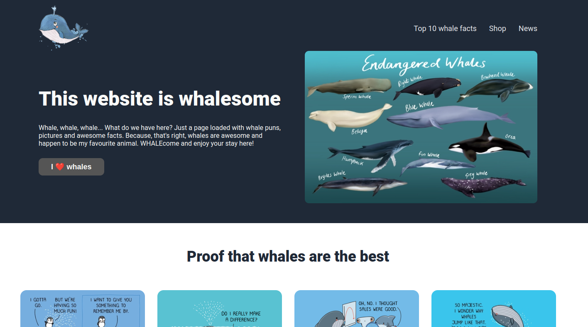

# Landing page
## Introduction

This project is a simple landing page dedicated to whales. It is built using the standard front-end stack of HTML and CSS.

The project primarily demonstrates use of Flexbox.

## Preview

## Media credits:

1. PNG find: https://bit.ly/3qwtwj7

2. Mel's brushes: https://bit.ly/32xxYWQ

3. Wawawiwa Comics: https://bit.ly/3mGpFz6 https://bit.ly/3sICuN5  https://bit.ly/3JwNP91 https://bit.ly/3sLEVi2

4. Soundspunos: https://bit.ly/3JrXVI1

5. Flaticon: https://bit.ly/3fTv6H3